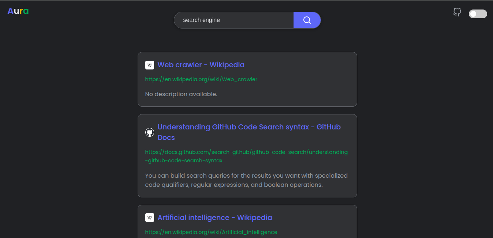

# Aura

Aura is a search Engine written in python

<div>

</div>

### Crawling

Seeds are used as a string point. Any url that is found is appended to a queue. With that we have random jumps after 5 seconds so the results can have some variety. We skip all files and only consider simple site data for now. We see the robots.txt to respect the sites rules. All the crawled data is saved ina jsonl file.

### Indexing

A simple reverse index for words is built along with icon, title, desc info for each url.

### Searcher

Simple TF-IDF Search

```python
idf = math.log(total_documents / (1 + num_docs_with_word))

# Go through the list of [doc_id, term_frequency] for the word
for doc_id_str, tf in inverted_index[word]:
    scores[str(doc_id_str)] += tf * idf
```

### Stemming

Stem the words while crawling and searching for better results. Like throwing, throwed -> throw

```shell
python3 -c "import nltk; nltk.download('punkt_tab')"
```

### Website

The front end is pretty much vibe coded as there isn't much right now.

### Note

The crawler indexer and everything is under heavy development. So stuff can change very rapidly
